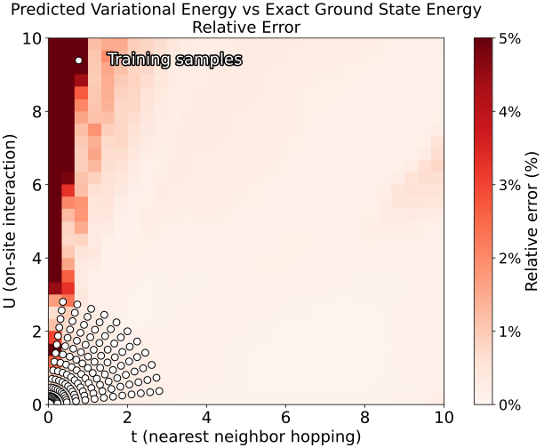

# GNN_Hubbard: Variational Optimization for 1D Hubbard Ground-State Energies with a Graph Neural Network.

  

This repository provides a complete, end-to-end pipeline for the **1-D Hubbard model with N sites** (periodic boundary conditions, **half-filling**):

1. **Train a Graph Neural Network (GNN)** on exact data generated for a range of Hubbard parameters **(U,t)** using graph embedding and variational optimization.
2. **Predict the ground-state energy** of the N-site chain for arbitrary (U,t) using the trained GNN.
3. **Assess the model** by comparing its predictions with **exact diagonalisation** and plotting a heat-map of the **relative error** across the (U,t) plane (See above figure).

The repository thus covers everything from data creation and GNN training to quantitative evaluation and visualisation of the results.

## 🗺️ Project Roadmap / TODO
| Priority | Milestone | Objective |
|:--:|:--|:--|
| **0** | **Scalable MC Training Loop** | Integrate **Monte-Carlo (MC) sampling** into the training pipeline so the model can:  • learn on **larger chains \(N\)**  • reliably cover the **insulating (strong-coupling) regime** |
| **1** | **RL-Driven Sampler** | Formulate the MC sampler as a sequential decision process and train a **reinforcement-learning policy** that proposes low-variance, high-quality configurations to speed up convergence |
| **2** | **Cross-Size Generalization** | Generate mini-batches that depend on **(N , U , t)** rather than just (U , t). By mixing several chain lengths in one batch and passing \(N\) as an explicit feature, a model trained on small systems can **generalization to larger size** |

> **✏️ Authorship Note**  
> This repository is part of an **ongoing project** carried out jointly by the co-first authors  
> **Jiwon Jeon** (<rocetio27@dgist.ac.kr>) & **Gimin Bae** (<pikachuhello@dgist.ac.kr>).
